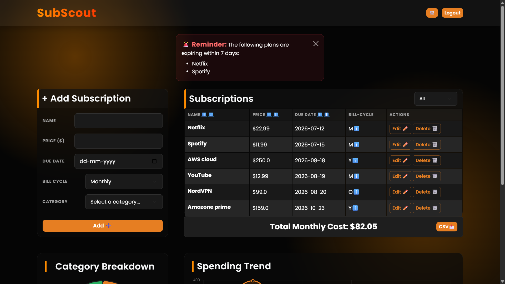

# SubScout 🕵️‍♂️

A smart subscription management dashboard built with Python and Flask. SubScout helps users track their recurring expenses, visualize spending trends, and avoid surprise auto-renewals.

 
*(Note: Rename your uploaded image to `screenshot.png` so it appears here)*

## ✨ Core Features
* **Smart Cost Calculation:** Accurately calculates the *True Monthly Cost* by automatically filtering out "Yearly" and "One-Time" expenses.
* **Renewal Alerts:** Real-time dashboard notifications for any subscription expiring within the next 7 days.
* **Data Visualization:** Interactive spending trend charts categorized by expense type (Entertainment, Tech, etc.).
* **Data Export:** One-click CSV download of all active subscription records.

## 🛠️ Tech Stack
* **Backend:** Python, Flask
* **Database:** SQLite
* **Frontend:** HTML5, CSS3, Bootstrap

## 🚀 How to Run Locally
1. Clone the repository: `git clone <your-repo-url>`
2. Install dependencies: `pip install -r requirements.txt`
3. Create a `.env` file and add your `SECRET_KEY`
4. Run the app: `flask run`
